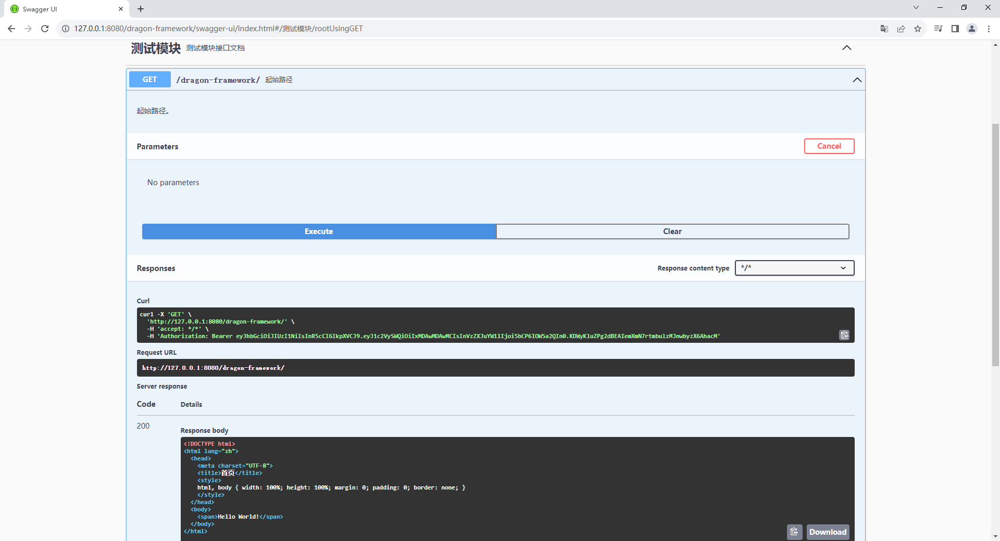

# 一、下载 springfox

```
git clone -b 3.0.0 --depth 1 git@github.com:freegithuber/springfox.git H:\workspaces\springfox-3.0.0
```

```
git checkout -b 3.0.0
```

```
H:\workspaces\springfox-3.0.0>git checkout -b 3.0.0
Switched to a new branch '3.0.0'

H:\workspaces\springfox-3.0.0>
```

# 二、下载 swagger-ui

```
git clone -b v3.52.5 --depth 1 git@github.com:swagger-api/swagger-ui.git H:\workspaces\springfox-3.0.0\dependences\swagger-ui-3.52.5
```

# 三、构建 springfox

```
cd H:\workspaces\springfox-3.0.0\springfox-swagger2

gradle clean jar
```

# 四、编译 swagger-ui

```
修改第 272 ~ 272 行：H:\workspaces\springfox-3.0.0\dependences\swagger-ui-3.52.5\src\core\components\parameter-row.jsx
```

```
修改第 171 ~ 179 行：H:\workspaces\springfox-3.0.0\dependences\swagger-ui-3.52.5\src\core\components\parameters\parameters.jsx
```

```
cd H:\workspaces\springfox-3.0.0\dependences\swagger-ui-3.52.5

npm install

npm run build
```

```
cd H:\workspaces\springfox-3.0.0\springfox-swagger-ui

npm install

npm run build
```

# 五、替换文件

```
H:\workspaces\springfox-3.0.0\dependences\swagger-ui-3.52.5\dist

替换到目录下

H:\workspaces\springfox-3.0.0\springfox-swagger-ui\build\swagger-ui-3.52.5\dist
```

# 六、修改文件

```
H:\workspaces\springfox-3.0.0\springfox-swagger-ui\build.gradle

注释掉 163 行，使其不再下载 swagger-ui-3.52.5 文件
```

# 七、再次构建 springfox

```
cd H:\workspaces\springfox-3.0.0\springfox-swagger-ui

gradle jar
```

# 八、目标文件

```
目录：H:\workspaces\springfox-3.0.0\docs

文件：H:\workspaces\springfox-3.0.0\springfox-swagger2\build\libs\springfox-swagger2-3.0.0-SNAPSHOT.jar
拷贝：H:\workspaces\springfox-3.0.0\docs\springfox-swagger-ui-3.0.0-SNAPSHOT.jar

文件：H:\workspaces\springfox-3.0.0\springfox-swagger-ui\build\libs\springfox-swagger-ui-3.0.0-SNAPSHOT.jar
拷贝：H:\workspaces\springfox-3.0.0\docs\springfox-swagger2-3.0.0-SNAPSHOT.jar
```


  

